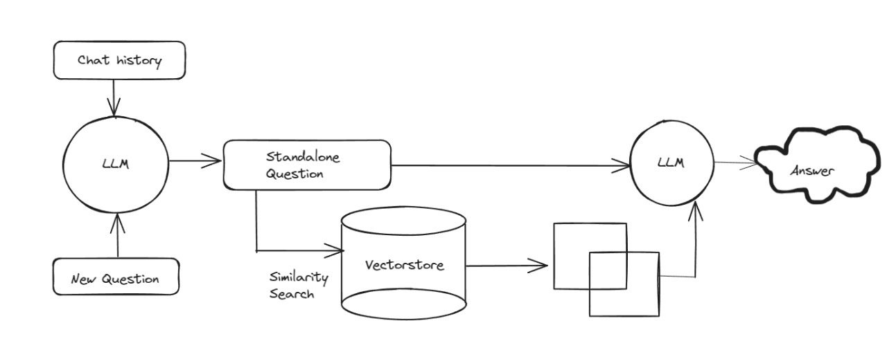

# Personalized-GPT

## Installation

Install Langchain and other required packages.
```
pip install langchain openai chromadb tiktoken unstructured
```

Place your own data into `data/data.txt`.

## Example usage
Test reading `data/data.txt` file.
```
> python perchat.py "what is my name"
Your name is Vijay.
```


# How to Obtain an OpenAI API Key

This guide will walk you through the steps to obtain an API key from OpenAI, which you will need to access OpenAI's powerful AI models, including GPT-3, Codex, and others.

## Step 1: Create an OpenAI Account

1. Go to [OpenAI's API sign-up page](https://beta.openai.com/signup/).
2. Enter your email address and password to create an account.
3. Verify your email address by clicking on the verification link sent to your email.

## Step 2: Sign In and Access the API Dashboard

1. After verifying your email, sign in to your OpenAI account.
2. Navigate to the API section on the dashboard or go directly to [OpenAI API Dashboard](https://beta.openai.com/account/api-keys).

## Step 3: Generate Your API Key

1. In the API Dashboard, you will see a section for managing your API keys.
2. Click on the "Create new key" button.
3. Give your key a name that helps you remember what application it's for.
4. The key will be generated and displayed to you. **Make sure to copy and keep it secure, as it will not be shown again.**

## Step 4: Keep Your API Key Secure

- **Never share your API key publicly** or with anyone you do not trust.
- It's recommended to use environment variables or a secrets manager to handle your API keys within your applications.


